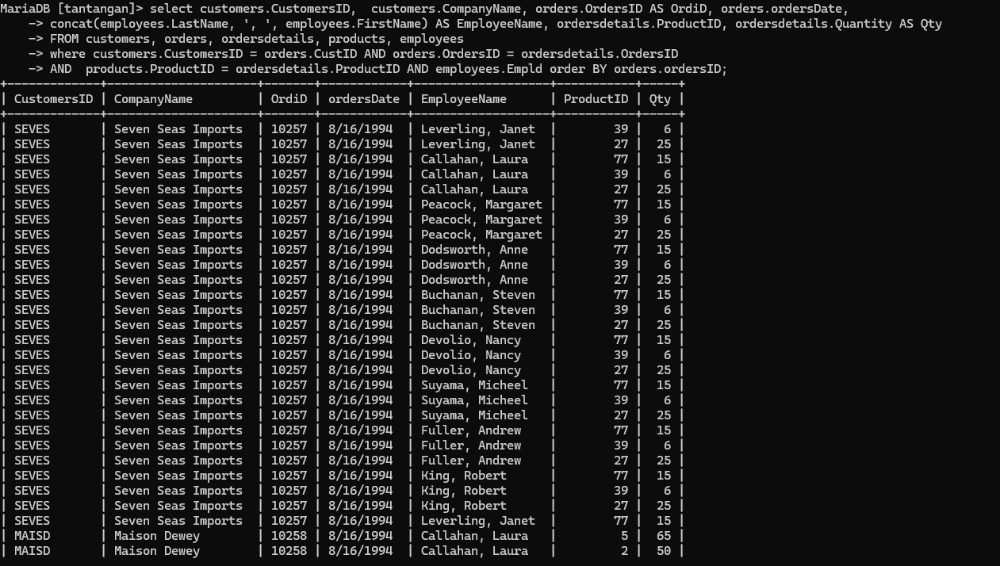
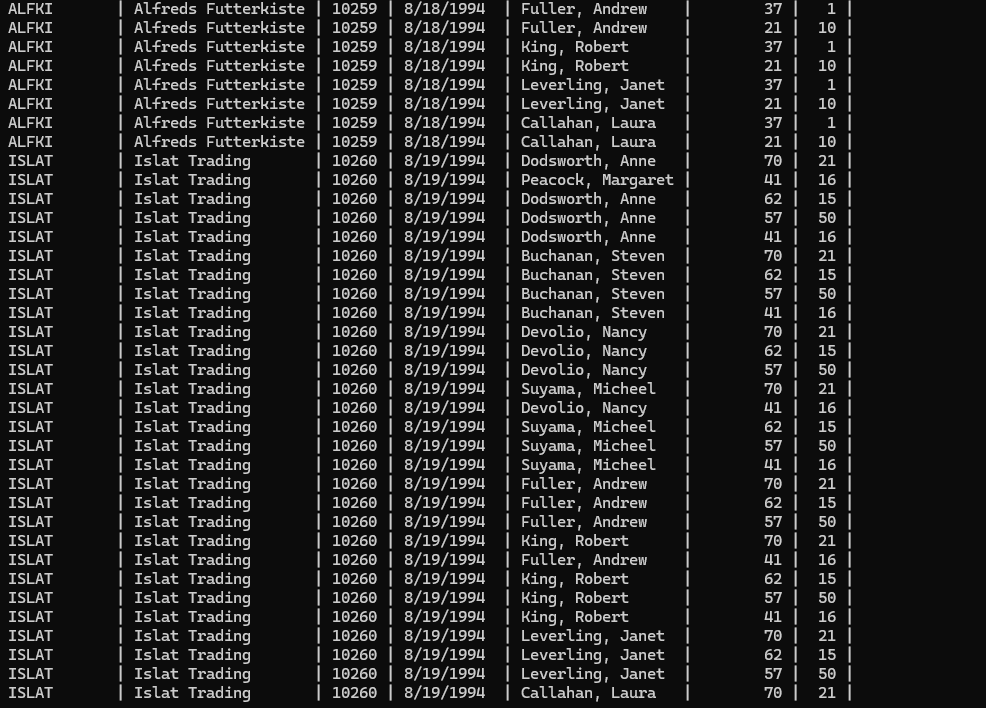
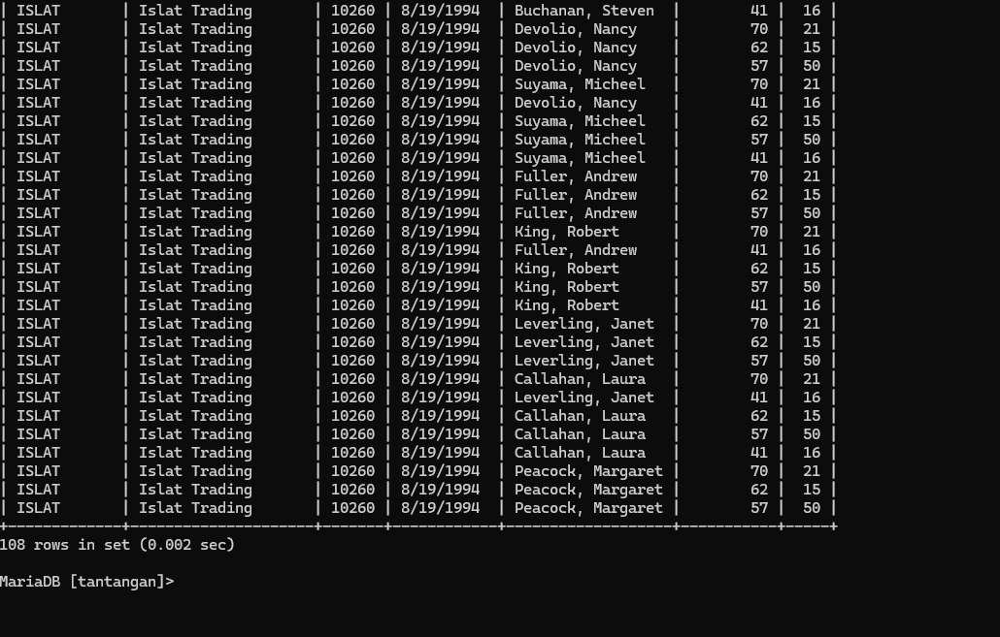
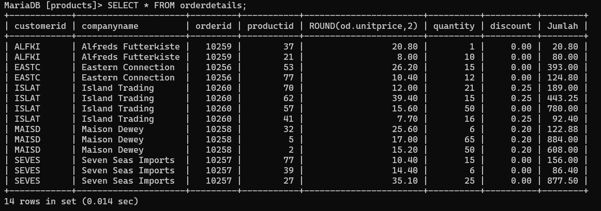
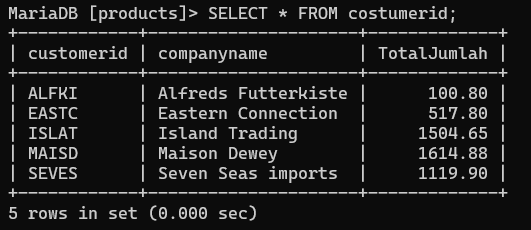

# Query 1
## Tabel Customers

## Tabel Orders

## Hasil Penggabungan
### Query
```SQL
SELECT 
 orders.OrderID,
 orders.OrderDate,
 orders.CustID,
 customers.ComapnyName,
 customers.ContactName,
 customers.City,
 customers.Phone 
  FROM orders,
   customers WHERE orders.CustID = customers.CustomerID;
```

### Hasil


### Analisis
- `SELECT` untuk memilih kolom mana saja Yang ingin ditampilkan dan dari tabel mana kolom tersebut diambil.

- `orders. Order ID` = orders merupakan nama tabel Yang ingin ditampilkan kolomnya Yaitu `orderID`. Jadi kolom `orderID` Pada tabel orders ingin ditampilkan. dalam `orders`, `OrderDate = `kolom order Date Pada tabel orders ingin ditampilkan.

- `orders. custID` = kolom ` CustID` dalam tabel orders dipilih untuk ditampilkan. customers. `company Name` = kolom `Company Name` dalam tabel customers dipilih untuk ditampilkan. 

- `customers.contactName` = kolom contactName dalam tabel customers dipilih untuk ditampilkan. `customers. city` = kolom City dalam tabel customers dipilih untuk ditampilkan.

- `Customers. Phone` = kolom Phone dalam tabel customers dipilih untuk ditampilkan.

- `FROM orders, customers` = untuk memilih dari tabel mana saja yang kolomnya ingin dipilih untuk ditampilkan. `Orders` adalah nama tabel Pertama yang dipilih dan customers adalah nama tabel kedua Yang dipilih.

- `WHERE `= Kondisi Yang harus dipenuhi oleh suatu kolom data agar bisa ditampilkan (`orders. custID = customers.customerID`) = kondisi dari `WHERE` Yang harus dipenuhi.

- Jadi, data Pada kolom `CustID` dalam tabel orders yang sama dengan data Pada kolom `customerID` dalam tabel `customers` agar masing-masing datanya bisa ditampilkan.

- Hasilnya = Jadi Yang tampil adalah kolom `OrderID`, `order Date` dan `custID` dari tabel orders dan kolom company Name, contact Name, city, dan Phone dari tabel customers..

# Query
## query
```sql
SELECT o.OrderID,o.OrderDate,o.CustID,c.CompanyName,c.ContactName,c.City,c.Phone FROM orders o,customers c WHERE o.CustID=
c.CustomerID AND c.City="London";
```
## hasil

## analisis
- `SELECT` untuk memilih kolom mana saja yang ingin ditampilkan dan dari tabel mana kolom tersebut diambil.
- `o.orderID` o merupakan singkatan dari tabel orders, kolom orderID merupakan kolom dari tabel orders yang dipilih untuk ditampilakan.
- `o.orderDate`kolom orderDate merupakan kolom dari tabel o yaitu orders yang dipilih untuk ditampilkan.
- `o.custID` kolom custID merupakan kolom dari tabel o yaitu orders yang ingin untuk ditampilkan.
- `c.companyname` c merupakan singkatan dari tabel customers. kolom companyname merupakan kolom dari tabel customers yang dipilih untuk ditampilkan.
- `c.contactname` kolom contactname merupakan kolom dari tabel c yaitu customers yang dipilih unutk ditampilkan.
- `c.city` kolom city merupakan kolom dari tabel c yaitu customers yang dipilih untuk ditampilkan.
- `c.phone` kolom phone merupakan kolom dari tabel c yaitu customers yang dipilih untuk ditampilkan.
- `FROM orders o.customers c` untuk memilih dari tabel dimana saja yang kolomnya ingin dipilih untuk ditampilkan. `orders` adalah nama tabel yang dipilih untuk ditampilkan tapi disingkat jadi `o`, agar lebih muda dan cepat. `customers` adalah nama tabel yang dipilih untuk ditampilkan tapi disingkat jadi `c`.
- `WHERE` kondisi yang harus dipenuhi oleh suatu kolom data agar bisa ditampilkan.
- `(o.custID = c.customerID)` data pada kolom custID dalam tabel `o`(orders) harus sama dengan data pada kolom customerID dalam tabel `c`(customers).
- `AND` untuk meyeleksi dua data atau leih pada perintah `WHERE`.
- `(c.city = "London")` kondisi tambahan yang harus dipenuhi juga. Jadi pada kolom city dari tabel `c`(customers) datanya harus berisi data "London" agar bisa ditampilkan.
- hasilnya = Jadi hanya barisan data yang kolom city dari tabel customers mempunyai data "London" yang bisa tampil.

# Query 3
## query
```sql
SELECT o.OrderID,o.OrderDate,CompanyName,c.ContactName,c.Phone,e.LastName,e.Title FROM orders o,customers c,employees e WHERE o.CustID
= c.CustomerID AND o.EmpID = e.Empld;
```
## hasil

## analisis
- `SELECT` untuk memilih kolom mana saja yang ingin ditampilkan dari tabel mana kolom tersebut diambil.
- `o.orderID,o.orderDate` kolom orderID dan orderDate dari tabel `o`(orders) dipilih untuk ditampilkan.
- `c.companyname,c.contactname,c.phone` kolom-kolom companyname,contactname dan phone dari tabel `c`(customers) dipilih untuk ditampilkan.
- `e.Lastname,e.Title` kolom lastname dan title dari tabel `e`(employees) dipilih untuk ditampilkan.
- `FROM orders o,customers c,employees e` untuk memilih dari tabel mana saja yang kolomnya dipilih untuk ditampilkan. orders disingkat jadi `o` adalah nama tabel yang dipilih. customers disingkat jadi `c` adalah nama tabel yang dipilih. employees disingkat jadi `e` adalah nama tabel yang dipilh untuk ditampilkan.
- `WHERE` kondisi yang harus dipenuhi oleh suatu data agar bisa ditampilkan.
- `(o.custID = c.customerID)` data pada kolom custID dalam tabel `o`(orders) harus sama dengan data pada kolom customerID dalam tabel `c`(customers).
- `AND` untuk meyeleksi dua data atau lebih pada perintah `WHERE`.
- `(o.empID = e.EmpID)` data pada kolom EmpID dalam tabel `o`(orders) harus sama dengan data pada kolom EmpID dalam tabel `e`(employees).
- hasilnya = yang tampil adalah kolom yang memenuhi semua kondisi dari `WHERE`.

# Query 4
## query
```sql
SELECT o.OrderID,o.OrderDate,c.CompanyName,c.ContactName,c.Phone,e.LastName,e.Title FROM orders o,customers c,employees e WHERE o.CustID = c.CustomerID AND o.EmpID = e.Empld AND e.FirstName = "Margaret";
```
## hasil

## analisis
- `SELECT` untuk memilih kolom mana saja yang ingin ditampilkan dari tabel mana kolom tersebut diambil.
- `o.orderID,o.orderDate` kolom orderID dan orderDate dari tabel `o`(orders) dipilih untuk ditampilkan.
- `c.companyName, c.contactName, c. Phone` kolom company Name, Contactiame dan Phone dari tabel C (customers) dipilih untuk ditampilkan.
- `e.Lastname, e.Title` kolom LastName dan Title dari tabel e (employees) dipilih. untuk ditampilkan.
- `From orders o customers c, employees e` untuk memilih dari tabel mana s Yang kolamnya dipilih untuk ditampilkan. orders atau a adalah nama tabel Yang dipilih untuk ditampilkan. customers atau a adalah nama tabel Yang dipilih untuk ditampilkan. employees atau e adalah nama tabel yang dipilih untuk ditampilkan.
- `WHERE` kondisi Yang harus dipenuhi oleh suatu kolom data avar bisa ditampilkan
- `(O.CustID = c.customerID)` data Pada kolom astID dalam tabel o (orders) hors Sama denson data Pada kolom customerID dalam table (customers).
- `AND` untuk menyeleksi dua data atau lebih Pada Perintah `WHERE`.
-  `(o.EmpID = e.Empld)` data pada kolom EmpID dalam tabel orders harus sama dengan data pada kolom Empld dalam tabel employees.
- `AND` untuk menyeleksi dua data atau lebih Pada Perintah `WHERE`.
- `(e.FirstName ="Margaret")` data pada kolom FirstName dalam tabel employees harus berisi data "Margaret" agar bisa tampil.
- hasilnya = jadi barisan data yang sudah memenuhi kondisi `WHERE` akan tampil. Terutama kolom FirtsName dari tabel employees yang isinya "Margaret".

# Query 5
### Kode Program
```mysql
SELECT orderdetails.OrderID, orderdetails.OrderDate, customerss.CompanyName,
    -> customerss.ContactName, customerss.Phone, employees.LastName, employees.Title
    -> FROM orderdetails, customerss, employees
    -> WHERE orderdetails.CustID = customerss.CustomerID AND orderdetails.EmpID = employees.Empld AND
    -> employees.FirstName = "Margaret";
```
### Hasil


### Analisis 
1. ` Select`= untuk memili kolom mana saja yang ingin di tampilkan dan dari tabel         mana kolom tersebut diambil
2. `o.orderID, o.orderdate` =kolom orderID dan orderdate dari tabel o (orders) dipilih untuk di tampilkan
3. `c.compnyname, c.contactrlame,c.phone =`kolom companyname, contactname
4. `e.lastname, e.title`= kolom lastname dan title dari table e (employees) di pilih untuk di tampilkan
5. `From order o , customers c , employees e`= untuk memilih tabel mana saja kolomnya di pilih untuk di tampilkan . orderys atau adalah nama tabel yang dipilih untuk ditampilkan  costomers atau  c adalah nama tabel yang di pilih untuk di tampilkan . employees atau e adalah nama tabel yang di pilih untuk di tampilkan
6. `where` - kondisi yang harus di penuhi oleh satu kolom data agar bisa di tampilkan
7. `(o.custid = c.customerID)` = data pada kolom custid dalam tabel o (orders) harus sama dengan data pada kolom costomersID dalam table c (costomers).
8. `AND`= untuk menyeleksi dia data atau lebih pada perintah where.
9. `(e.empid= e.Empid)` = data pada kolom firstname dalam tabel e employees harus berisi data "margaret" agar bisa tempil.


# Query 6 ****
### Kode Program
```mysql
select customers.CustomersID, customers.CompanyName, orders.OrdersID,
orders.OrdersDate, ordersdetails.ProductID, products.ProductName, ordersdetails.Quantity AS Qty, ordersdetails.UnitPrice
FROM customers, orders, ordersdetails, products
WHERE customers.CustomersID= orders.CustID AND orders.OrdersID= ordersdetails.OrdersID
AND products.ProductID = ordersdetails.ProductID
order by customers.CustomersID;
```
### Hasil

### Analisis
1. `select` = untuk memilih kolom mana saja yang ingin ditampilkan  dan dari tabel mana kolom tersebut diambil.
2. `c.customerID ,  c.companyname` = kolom customerID  dan companyname dari tabel c (customers) dipilih untuk ditampilkan.
3. `o.orderID,  o,orderDate `= kolom orderID dan orderDate dari tabel p (orders) dipilih untuk ditampilkan 
4. `od.productID, od.Quantity, od.unitprice`  = kolom productID, Quantity dan unitprict dan tabel ad (orderdetails) di pilih untuk di tampilkan.
5. `P.Productname `= kolom productname  merupakan kolom dari tabel p (Products) yang di pilih untuk di tampilkan 
6. `od.Quantity AS  Qty `= kolom Quentity di tampilkan sebagai nama sementaranya yaitu Qty. AS untuk mengubah nama suatu kolom secara sementara.
7. `FROM customers c. orders o, orderdetails od, products p` = untuk memilih dari tabel mana sata yang kolamnya dipilih untur ditampilkan, customers atv C adalah nama tabel Yang dipilih untuk ditampilkan, orders atau o sabah nama tabel Yang dipilih untuk ditampilkan orderdetails atau ad adalah nama tabel yang dipilih untuk ditampilkan. Products atau  P adalah nama) tabel yang dipilih untuk ditampilkan.
8. `WHERE` = Kondisi yang harus dipenuhi oleh suatu kolom data adar bisa ditampilka le curterere) (c.customerID = O.CustID) = data Pada kolom customerID dari tabel customers atau a harus sama dengan data Pada kolom CustID dari tabel orders atau o.
9. `AND `= Untuk menyeleksi dua data atau lebih foda perintah WHERE.  (o.orderTD=od.orderID)=data Pada kolom orderID dari tabel orders atau o harus sama dengan data Pada kolom orderId dari tabel orderdetails atau od.
10. `AND` = untuk menyeleksi dua data atau lebih Pada Perintah WHERE. (Product) (P. ProductID = od. ProductID) =data Pada kolom ProductID dari tabel Products atau P harus sama dengan data Poda kolom ProductID dan tabel ordendetails atau d
11. `order By c.customerID `= untuk mengurut data berdasarkan kolom CustomerID dari tabel customers.


# Query 7

### Kode Program
```mysql
select customers.CustomersID,  customers.CompanyName, orders.OrdersID AS OrdiD, orders.ordersDate,
     concat(employees.LastName, ', ', employees.FirstName) AS EmployeeName, ordersdetails.ProductID, ordersdetails.Quantity AS Qty
     FROM customers, orders, ordersdetails, products, employees
     where customers.CustomersID = orders.CustID AND orders.OrdersID      = ordersdetails.OrdersID
     AND  products.ProductID = ordersdetails.ProductID AND employees.Empld order BY orders.ordersID;
```

### Hasil




### Analisis
1. `SELECT` = untuk memilih kolom mana saja yang ingin ditampilkan dan digabungkan serta dari tabel mana kolom tersebut dipilih
2. `c. customerID, C. companyName` = kolom customerID dan company Name dari tabel c(customers) dipilih untuk ditampilkan.
3. `o.OrderID AS ordID, o.OrderDate` = kolom orderID dan OrderDate dari tabel!  o(orders) dipilih untuk ditampilkan. As merupakan Perintah untuk mengubah nama Suatu kolom secara sementara. Dalam hal ini Kolom order ID diubah namanya sementara mentid ordI
4. `CONCAT(e.LastName,'.', e.FirstName) AS EmployeeName` = `CONCAT` adalah Perintah untur menggabungkan beberala kolom data menjadi satu kolom data. `(e.LastName", e. First Name)` merupakan kolom-kalam Yang ingin digabungkan LastName dan FirstName merupakan kolom dari tabel e(employees) Yang ingin didabung. ('.') merupakan separator atau Pemisah dari kedua kolom Yang ingin digabungkan. `As Employee `Name untuk mengubah hasil concat tadi menjadi Employee (namanya) untuk sementara.
5. `od.ProductID AS ProdID, od. Quantity AS Qty `= kolom ProductID dan Quantiy dari tabel od(orderdetails), dipilih untuk ditampilkan. kolom ProductID namanya diubah sementara Jadi ProdID. kolom Quantity namanya diubah Sementara Jadi Qty.
6. `P. ProductName` = kolom ProductName dari tabel P(Products) dipilih untuk ditampilkan. 
7. `From customers corders o, orderdetails od, Products P, employees e` = untuk memilih dari tabel mana saja yang kolomnya dipilih untuk ditampilkan customers atau C adalah nama tabel yang dipilih. orders atau o adalah nama tabel Yong dißlih order details od adalah nama tabel Yang dipilih. Products atau P adalah nama tabel yang dipilih. employees atau e adalah nama tabel Yand dipilih.
8. `WHERE `kondisi Yang harus dipenuhi oleh suatu kolom data ag ar bisa ditampilkan.
9. `(c.custornerID=o. costID )=` data Pada kolom customerID dari tabel c(customers) harus sama dengan data Pada kolom CustID dari tabel o(orders)
10. `AND `= untuk menyeleksi dua data atau lebih Pada Perintah WHERE.
11. `(o.OrderID = od orderID) `= data Pada kolom orderID dari tabel o (orders) harus Sama dengan data Pada kolom order ID dari tabel od (orderdetails).
12. `AND `= untuk menyeleksi dua data atau lebih Pada Perintah WHERE.
13. `(P.ProductID=od. ProductID)` = data Pada kolom ProductID dari tabel PCProductID) harus sama dengan data Pada kolom ProductID dari tabel od (orderdetails)
14. `AND `= untuk menyeleksi dua data atau lebih Pada Perintah WHERE.
15. `(e. EmPID = o. EmpID)` = data Pada kolom EmpID  dari tabel e(employees) harus sama dengan data Pada kolom EmPID dari tabel o(orders).
16. `order By o. orderID `= untuk mengurut data berdasarkan kolom orderID dari tabel orders.

# Query 8
### Struktur
```sql
SELECT * FROM order_details;
```
### Hasil

### Analisis
- `CREATE VIEW odproduct`: Untuk membuat tabel virtual dengan nama odproducts.
- `AS SELECT`: Untuk memilih kolom-kolom mana saja yang ingin dipilih untuk dimasukkan ke tabel virtual.
- `od.orderID, od.ProductID, od.unitPrice, od.quantity`: Kolom orderID, ProductID, UnitPrice dan Quantity dari tabel od(orderdetails) dipilih untuk dimasukkan.
- `P.ProductName`: Kolom ProductName dari tabel P(Products) dipilih untuk dimasukkan 
- `FROM orderdetails od,Products P`: Untuk memilih dari tabel mana saja yang kolomnya dipilih untuk dimasukkan. orderdetails dan products adalah nama tabek yang dipilih.
- `WHERE`: Kondisi yang harus dipenuhi oleh suatu data agar bisa dimasukkan ke dalam tabel virtual.
- `(P. ProductID=od. ProductID)`: Data pada kolom ProductID dari tabel P(Product) harus sama dengan kolom ProductID dari tabel od(orderdetails), agar bisa dimasukkan.
- `Hasilnya`: Tabel virtual yang bernama odproducts yang terbuat dari kolom dalam 2 tabel, orderdetails dan products.
# Query 9
### Struktur
```sql
SELECT * FROM orderdetails;
```
### Hasil

### Analisis
- `SELECT`: Untuk memilih kolom mana saja yang ingin ditampilkan dan dihitung.
- `c.customerID, c.companyName`: Kolom costumerID dan companyName dari tabel c(customers) dipilih untuk ditampilkan.
- `o.orderID`: Kolom orderID dari tabel o(orders) dipilih untuk ditampilkan.
- `od. ProductID, od.unitPrice, od.quantity, od.Discount`: Kolom ProductId, UnitPrice, Quantity dan Discount dari tabel od(orderdetails) dipilih untuk ditampilkan dan dibulatkan.
- `ROUND (od.UnitPrice,2)`: Untuk membulatkan bilangan dari kolom unitPrice sampai jumlah digit tertentu sesuai dengan pilihan yang dibuat yaitu 2.
- `ROUND(((1-od.Discount)*od.unitPrice* od.Quantity),2) AS Jumlah`: Untuk membulatkan bilangan dari kolom hasil dari (1 dikurang kolom discount) lalu dikali unitPrice dan kali Quantity) sampai jumlah digit yaitu 2. AS jumlah untuk mengubah kolom hasil tersebut nama sementaranya jadi jumlah.
- `FROM customers c,orders o,orderdetails od`: Untuk memilih dari tabel nama saja yang kolomnya dipilih untuk ditampilkan dan dibulatkan customers. orders, orderdetails merupakan nama-nama tabel yang dipilih.
- `WHERE`: Kondisi yang harus dipenuhi oleh suatu data agar bisa ditampilkan.
- `(c.customersID=o.custID)`: Data pada kolom customers dari tabel c(customers) harus sama dengan data pada kolom custID dari tabel o(orders).
- `AND`: Untuk menyeleksi dua data atau lebih pada kondisi WHERE.
- `(o.orderID=od.orderID)`: Data pada kolom orderID dari tabel od(orderdetails).
- `ORDER BY c.customerID`: Untuk mengurut data berdasarkan kolom customers dari tabel c(customers).
- `Hasil`: Akan tampil hasil pembulatan dari kolom-kolom yang telah memenuhi kondisi dari WHERE.
# Query 10  
### Struktur
```sql
SELECT * FROM costumerid;
```
### Hasil

### Analisis
- `SELECT`: Untuk memilih kolom mana saja yang ingin ditampilkan dan dibulatkan.
- `C.customerID, C.companyName`: Kolom customeID dan companyName dari tabel c(customers) dipilih untuk ditampilkan.
- `ROUND (SUM((1-od.discount) *od.unitprice* od.quantity),2) AS Total jumlah`: Untuk membulatkan hasil SUM dari ((1 dikurang kolom Discount) dikali unitprice kali Quantity) sampai 2 digit. Dan nama kolom hasilnya di ubah sementara jadi total jumlah.
- `FROM customers c,orders o, orderdetails od`: Untuk memilih dari tabel mana saja yang kolomnya dipilih untuk ditampilkan dan dibulatkan. customers orders dan orderdetails adalah nama tabel yang dipilih.
- `WHERE`: Kondisi yang harus dipenuhi oleh suatu data agar bisa ditampilkan.
- `(c.customerID=o.custID)`: Data pada kolom customerID dari tabel c(customers) harus sama dengan data pada kolom custID dari tabel o(orders).
- `AND`: Untuk menyeleksi dua data atau lebih pada kondisi WHERE.
- `(o.orderID=od.orderID)`: Data pada kolom orderID dari tabel o(orders), harus sama dengan data pada kolom orderID dari tabel od(orderdetails).
- `GROUP BY c.customerID, c.companyName`:Untuk mengelompokkan data sesuai dengan kolom customerID dan companyName dari tabel c(customers).
- `ORDER BY c.customerID`:Untuk mengurut data berdasarkan kolom customerID dari tabel c(customers).
- `Hasil`:Jadi, kolom yang dikelompokkan adalah customerID dan companyName dan data tampilannya diurutkan berdasarkan kolom customerID.

  


